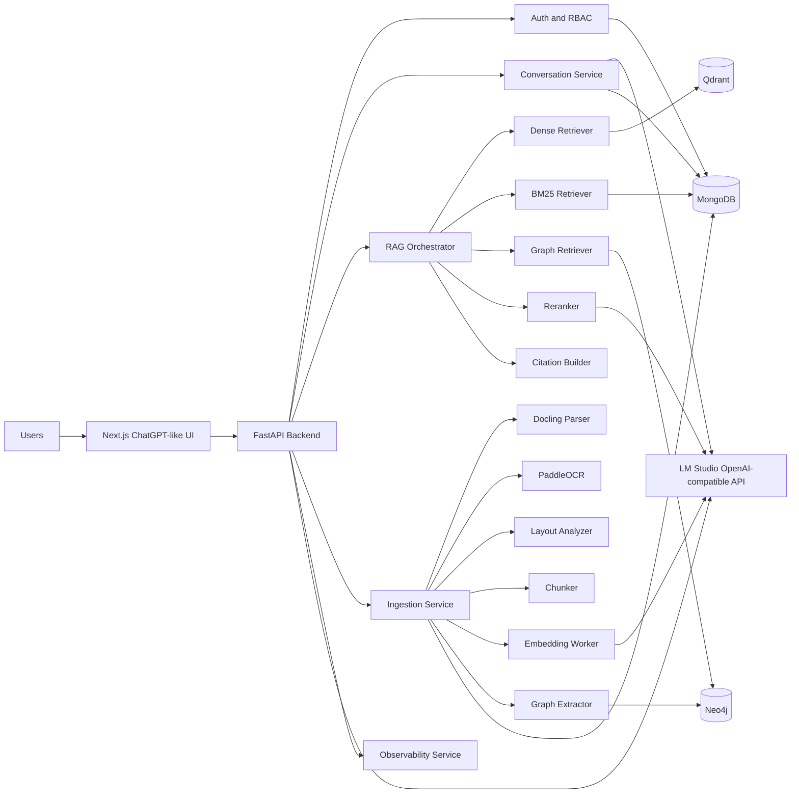
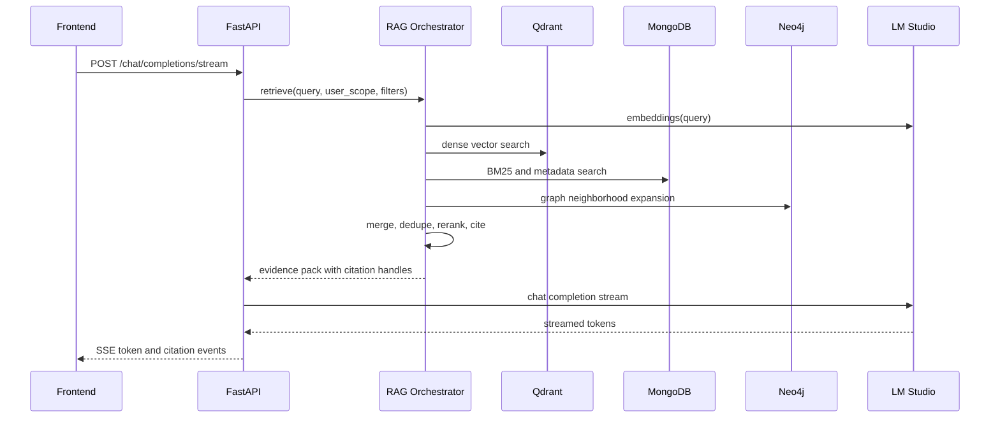
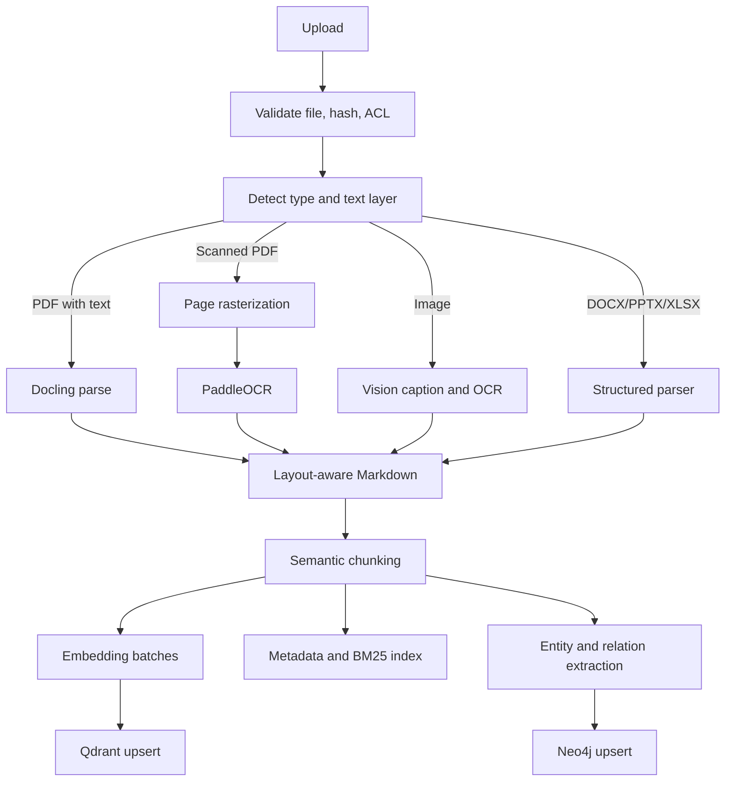

# System Architecture

## Objective

Build a production-grade, private-intranet assistant with a ChatGPT-like user experience, local-only inference through LM Studio, document-grounded answers with citations, multimodal ingestion, role-based access control, audit logging, and operational visibility.

The system is designed so every request stays inside the private Linux VM or its private service network. No cloud services, external APIs, telemetry beacons, hosted model endpoints, or internet dependencies are required during operation.

## High-Level Architecture

## Deployment Topology

All application services run on one Linux VM. Docker Compose will manage application containers in Phase 7. LM Studio runs as a local host process or as a separately managed local service exposing OpenAI-compatible endpoints on a private address such as `http://host.docker.internal:1234/v1` or a VM-local interface.

Production services:

- `frontend`: Next.js application serving the ChatGPT-like interface.
- `backend`: FastAPI application exposing REST, Server-Sent Events, and WebSocket-compatible control paths.
- `mongodb`: persistent document database for users, sessions, conversations, files, jobs, metadata, sparse indexes, audit events, and settings.
- `qdrant`: vector database for dense chunk embeddings.
- `neo4j`: graph database for entities, concepts, topics, relationships, documents, sections, and chunks.
- `lm-studio`: local inference server managed outside the app compose stack unless a future LM Studio Linux packaging strategy supports containerized operation cleanly.
- `gpu-exporter`: local GPU telemetry collector in Phase 7.

## Trust Boundaries

The intranet browser-to-frontend boundary is the only user-facing edge. The frontend never talks directly to LM Studio, MongoDB, Qdrant, or Neo4j. All privileged actions go through FastAPI.

The backend authenticates every request except public health checks. Authorization is enforced before conversation access, file access, retrieval, citation display, settings changes, and admin actions.

Uploaded files are stored on local disk or mounted object-style storage inside the VM. File metadata, hashes, ownership, status, and access policy live in MongoDB. Raw file bytes are never sent outside the private VM.

## Model Serving

LM Studio provides OpenAI-compatible endpoints:

- `GET /v1/models` for model status and discovery.
- `POST /v1/chat/completions` for text and vision chat completions.
- `POST /v1/embeddings` for embedding generation.

The backend uses a dedicated `ModelGateway` abstraction so model IDs, context limits, temperature defaults, batch sizes, and modality support can be changed without rewriting chat, ingestion, or retrieval code.

Recommended modular model configuration:

| Purpose | Default Model | Notes |
| --- | --- | --- |
| Primary reasoning | Qwen3 32B Instruct, quantized | Used for chat, synthesis, entity extraction, and graph relationship extraction. |
| Vision | Qwen2.5-VL | Used for image question answering and visual document inspection. |
| Embeddings | BGE-M3 | Used for dense retrieval over text, layout-derived Markdown, tables, OCR output, and image captions. |
| Reranking | Configurable local reranker or primary LLM scoring | Uses local-only scoring. If a dedicated reranker model is unavailable, the backend performs constrained LLM relevance scoring. |

## GPU Strategy

The A40 48 GB profile is optimized by keeping model configuration explicit and reload-aware:

- Prefer one primary text model loaded for interactive chat.
- Use quantized 32B reasoning model for a practical latency and context balance.
- Load the vision model only when needed if VRAM pressure requires it.
- Batch embeddings during ingestion with bounded concurrency.
- Use backpressure when active chat sessions and ingestion jobs compete for GPU capacity.
- Track GPU utilization, VRAM usage, model load state, queue depth, token throughput, and first-token latency.

TensorRT integration is treated as an optimization path when the local model runtime supports it. The application contract does not depend on TensorRT being available.

## Chat Flow

1. User sends a message through the Next.js UI.
2. Backend verifies session and conversation authorization.
3. Backend stores the user message and any file references.
4. Backend determines whether retrieval, vision, or plain chat is required.
5. RAG Orchestrator performs retrieval when documents or knowledge sources are in scope.
6. Prompt Builder assembles system instructions, conversation context, retrieved evidence, citation handles, and user message.
7. ModelGateway streams a completion from LM Studio.
8. Backend streams tokens to the UI using Server-Sent Events.
9. Backend stores assistant message, token metrics, retrieval trace, citations, and audit record.

## Retrieval Flow

Hybrid retrieval combines:

- Dense vector search in Qdrant.
- Sparse BM25 search backed by MongoDB text indexes or a local lexical index maintained by the backend.
- Metadata filtering for workspace, owner, role, document type, tags, time range, page range, and ingestion status.
- Neo4j graph retrieval for entity and concept neighborhoods.
- Local reranking across the merged candidate set.

## Multimodal Ingestion Flow

Supported inputs:

- PDFs with text layers.
- Scanned PDFs.
- Images, charts, tables, diagrams, and screenshots.
- DOCX, PPTX, XLSX.

Each ingested chunk stores source document, page number, section, bounding boxes when available, content type, table or figure identifiers, hash, embedding version, and permissions.

## Citation Strategy

Every grounded answer carries citations generated from retrieved chunks. Citations are not free-form strings; they are structured references that the UI can render and users can inspect.

Citation fields:

- Source document title and file ID.
- Page number or page range.
- Section heading.
- Chunk ID.
- Confidence score.
- Retrieval method contribution.
- Optional bounding box for visual highlighting.
- Snippet generated from stored chunk text.

The backend only returns citations that the current user is authorized to view.

## Authentication and Authorization

The system uses local username/password authentication with secure HTTP-only cookies, role-based access control, and server-side sessions.

Roles:

- `user`: create chats, upload files, query accessible knowledge.
- `power_user`: manage own document collections and shared workspace documents.
- `admin`: manage users, models, retention, audit exports, and system settings.

Authorization is enforced on:

- Conversations.
- Messages.
- Files.
- Documents and chunks.
- Citations.
- Ingestion jobs.
- Admin settings.
- Knowledge graph neighborhoods.

## Observability

Observability is local-only and available through backend endpoints and admin UI surfaces.

Signals:

- Application health.
- LM Studio connectivity and model availability.
- MongoDB, Qdrant, and Neo4j readiness.
- GPU utilization and VRAM usage.
- Active requests and streaming sessions.
- Ingestion job state.
- Retrieval latency by stage.
- Token throughput, time to first token, total generation time.
- Authentication failures.
- Audit log volume and export status.

Logs are structured JSON and include correlation IDs. User content is excluded from logs unless an admin explicitly enables a short-lived diagnostic mode with audit tracking.

## Security Controls

- HTTP-only, secure, same-site cookies.
- Password hashing with Argon2id.
- CSRF protection for browser-originating state changes.
- File type allowlist and size limits.
- Malware scanning integration point for local scanners in Phase 7.
- Per-user and per-role rate limits.
- Query-time ACL filters for MongoDB, Qdrant payloads, and Neo4j graph traversal.
- Audit logging for authentication, uploads, ingestion, retrieval, chat generation, settings changes, and admin access.
- Local secret management through Docker secrets or mounted files in Phase 7.

## Reliability Controls

- Backend startup performs dependency readiness checks.
- LM Studio failures produce explicit degraded model status rather than silent fallback.
- Streaming responses persist partial assistant messages with completion state.
- Ingestion jobs are resumable from deterministic file hashes and stage checkpoints.
- Qdrant and Neo4j writes are idempotent using stable document, chunk, entity, and relationship IDs.
- Background workers use bounded queues to protect GPU and database resources.

## Production Constraints

- No external network calls during normal operation.
- No cloud telemetry.
- No OpenAI, Anthropic, or hosted inference APIs.
- No mock services in production configuration.
- No placeholder model IDs in runtime config.
- No unauthenticated access to private data.
- No direct frontend access to storage or model-serving internals.
